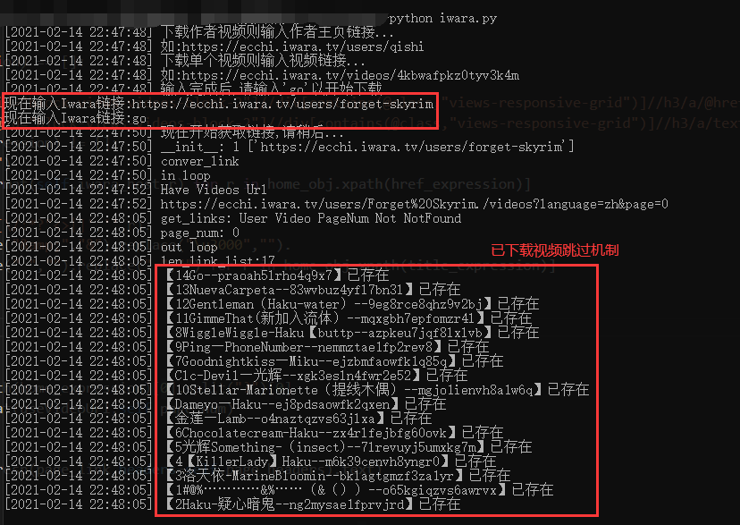
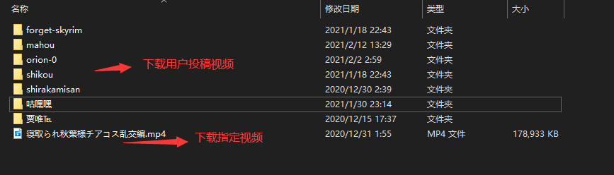

## Iwara下载脚本 V1.0.5

---

功能：

- [x] 支持下载`iwara`用户公开投稿的所有视频，视频文件下载存放在`./down/用户名`或`ROOT_DIR/用户名`文件夹下
  - [x] 支持自定义下载路径 (`ROOT_DIR=your path`)
- [x] 支持单个`iwara`视频链接下载，视频文件下载存放在`./down`或`ROOT_DIR`文件夹下
- [x] **添加视频完整性校验机制** (校验失败会进行重试、会删除校验失败的视频)——22.3.11
- [x] **添加重试机制** (默认3次，`RETRY_COUNT=3`)，支持重试网络错误或校验失败的视频——22.3.11
- [x] 支持添加`cookie`下载`private`视频
- [x] 多线程下载（默认8线程，`THREAD_NUM=8`）
- [x] 日志记录功能，支持`debug`模式打印更多`log` (`DEBUG=True`)


使用方法：

```
pip install -r requirement.txt
python iwara.py
```

其他：

+ 出现长时间卡住或不打印log的情况，使用`Ctrl + C`或直接关掉窗口以重新启动脚本


运行截图





