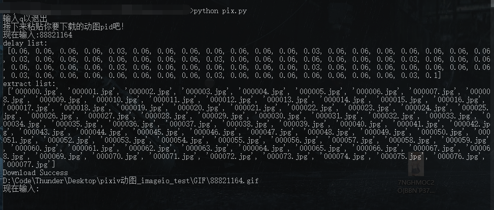
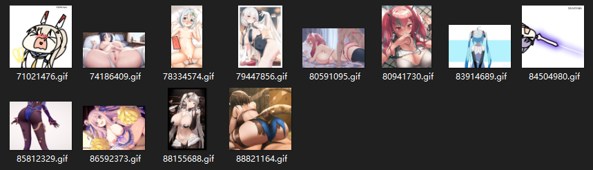

## Pixiv动图合成脚本 v1.0.1——2021年4月20日

---

Pixiv动图是所谓的多图轮播，只是每一张图的停留时间较长

---

功能：

- [x] 合成Pixiv动图
- [x] 自动清理临时文件
- [x] 网络请求自动重试


使用方法：

1、安装依赖

```
pip install -r requirement.txt
```

2、运行

```
python pix.py
```


运行截图




