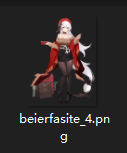
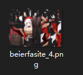
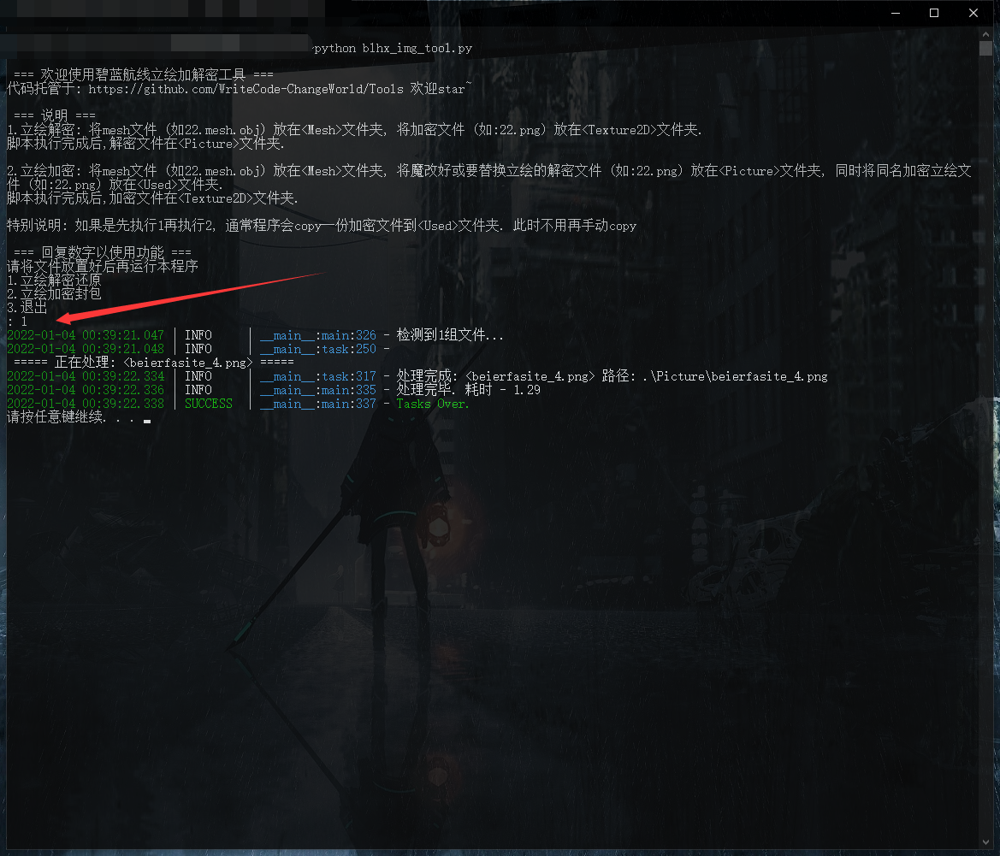

## 碧蓝航线静态立绘解密&加密工具 v1.1

---

+ 这是一个用于**解密**和**重新加密**碧蓝航线立绘的脚本——2022.1.4
+ 解密算法是贴吧某篇帖子提供的(已经不记得是哪位用户了，有知道的可以提个issue)
+ 加密算法是自己根据解密算法逆推并一步步调试出来的
+ 主要用途

1、**解密**加密图像从而得到游戏内的立绘文件



2、将经过修改的图片**重新加密**




### 功能

- [x] 解密碧蓝航线加密立绘
- [x] 将修改过的立绘重新加密回去
- [x] 提供较详细的说明（程序启动时）
- [x] 提供debug模式和日志记录
- [x] 提供批量解密/加密


### 目录结构

```bash
.
|-- Mesh 		# mesh纹理文件
|-- Picture 	# 解密立绘文件夹
|-- Readme.md
|-- Test		# 提供了部分测试文件
|-- Texture2D    # 加密立绘文件夹
|-- Used		# 由程序copy保留的加密立绘文件夹
|-- blhx_img_tool.py
|-- img
`-- requirement.txt
```


### 解密立绘

需要：

+ 加密立绘 --> `Texture2D`目录
+ 加密立绘同名`mesh`文件 --> `Mesh`目录

得到：

+ 解密立绘 --> `Picture`目录
+ copy加密立绘 --> `Used`目录（用于在加密时使用，不需要动）



> 非`debug`模式下的`立绘解密还原log`

---

### 加密立绘

需要：

+ 解密立绘 --> `Picture`目录
+ 解密立绘同名`mesh`文件 --> `Mesh`目录
+ 之前的加密立绘 --> `Used`目录（通常由程序copy）

得到：

+ 加密立绘 --> `Texture2D`目录


> 非`debug`模式下的`立绘加密还原log`

---

### 使用方法

```bash
# 安装依赖
pip install -r requirement.txt
# 运行脚本
python blhx_img_tool.py
```


