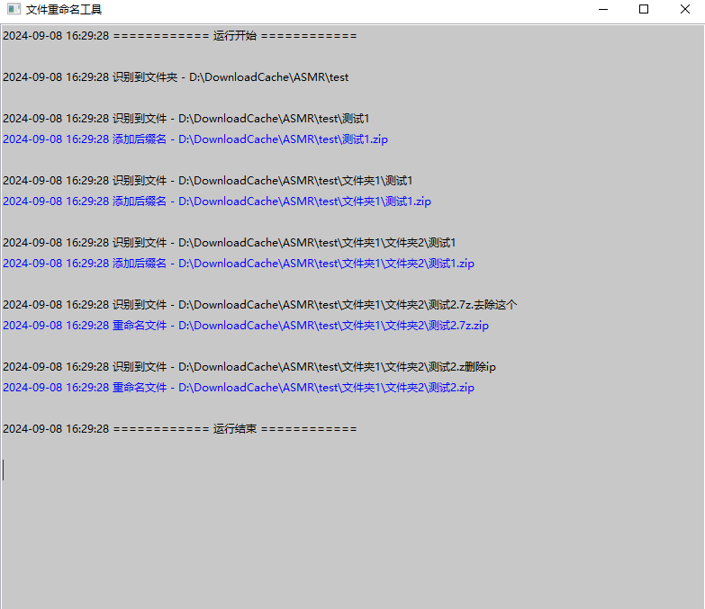

## 批量拖拽-文件后缀名重命名工具 v1.0

### 功能

+ 支持拖拽文件夹/单个文件/多个文件到GUI界面进行批量重命名
+ 后缀名检测
  + 全中文/检测名单后缀名 -> 替换为默认后缀名
  + 部分中文后缀名 -> 去除中文
  + 无后缀名 -> 添加默认后缀名

+ 涉及修改的文件、未知类型文件会高亮显示
+ 支持自定义跳过的后缀名




### 后续可能的更新

+ 检测名单和跳过名单独立为配置文件，提供exe打包
+ 重命名并调用bandizip解压


### 其他

因为目前没有将检测名单和跳过名单独立为配置文件，所以没有打包为exe，个人还是用脚本类型（主要是方便修改，也有可能后续空闲会补上这个坑）

附上打包命令

```bash
pyinstaller --onefile --noconsole filerenamer.py
```

